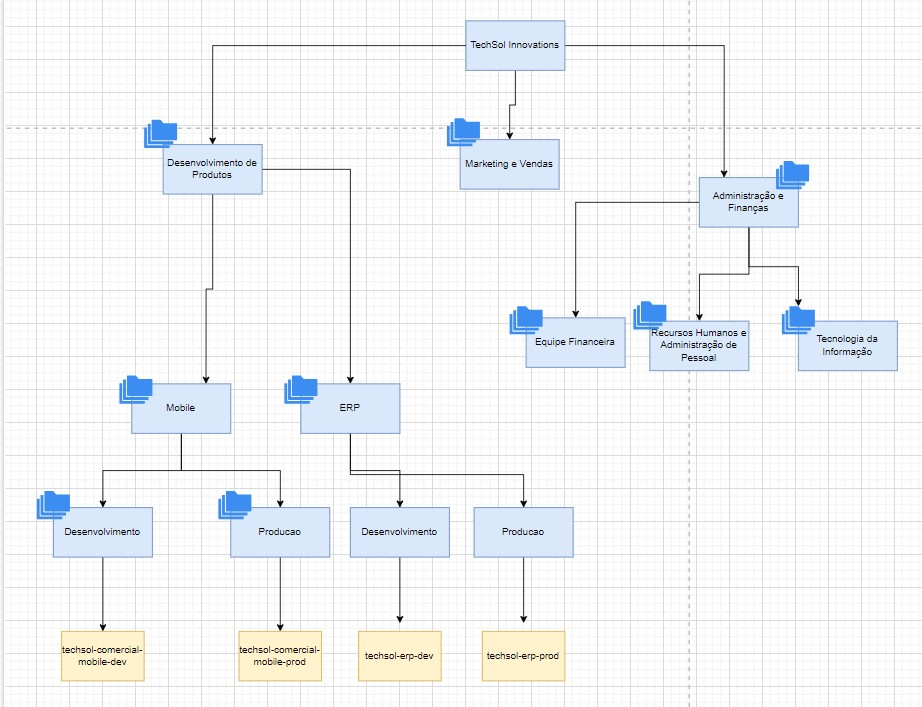
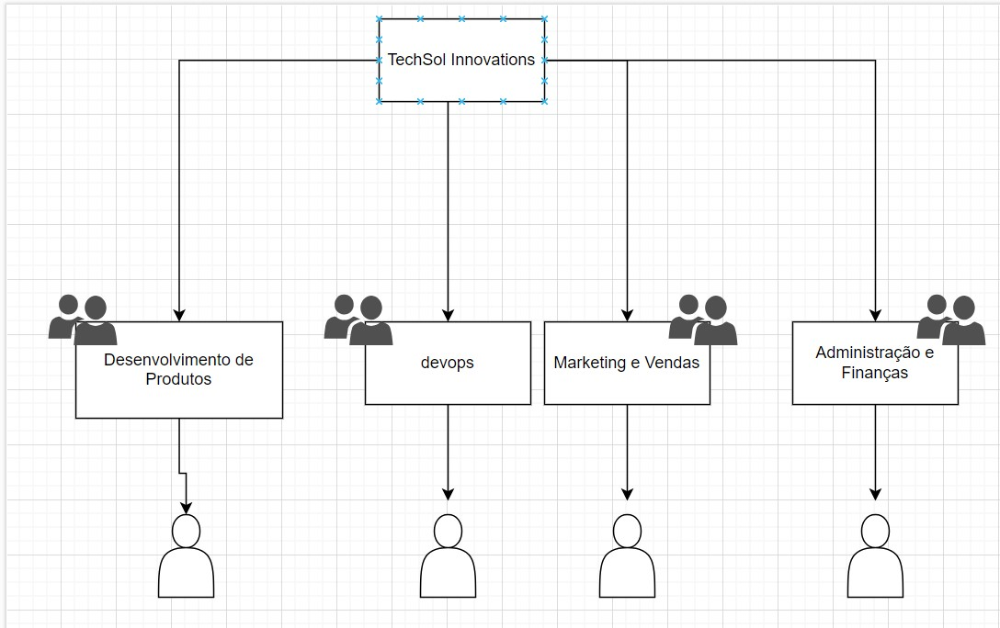

# Terraform para criação de estrutura de Pastas e Projetos no GCP

- Estrutura da organização junto dos projetos

- Organização dos grupos

# Criação de orçamento para a pequena empresa

Baseado no grupo organizacional criado e nos projetos ativos em cada pasta/grupo. Foi deferido o valor de 10mil mensalmente para manter todos os projetos.
Caso houvessem mais, o entendimento seria aumentar o orçamento.

Por fim, foram adicionados alertas a cada 25%, deixando assim os responsaveis mais situados sobre a situação do orçamento.

